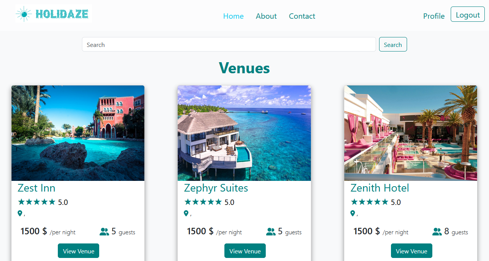

# Project-Exam-2

## Holidaze



This is a project exam 2 for Front-end Development at Noroff.

## Brief

A newly launched accommodation booking site called Holidaze has approached you to develop a brand new front end for their application. While they have a list of required features, the design and user experience has not been specified. Working with the official API documentation, plan, design and build a modern front end accommodation booking application.

There are two aspects to this brief: the customer-facing side of the website where users can book holidays at a venue, and an admin-facing side of the website where users can register and manage venues and bookings at those venues.

## Requirements

All API functionality is managed by an existing application. This project only covers the front-end application for the API.

## User stories

The client has specified the following requirements in the form of User Stories:

1. A user may view a list of Venues
2. A user may search for a specific Venue
3. A user may view a specific Venue page by id
4. A user may view a calendar with available dates for a Venue
5. A user with a stud.noroff.no email may register as a customer
6. A registered customer may create a booking at a Venue
7. A registered customer may view their upcoming bookings
8. A user with a stud.noroff.no email may register as a Venue manager
9. A registered Venue manager may create a Venue
10. A registered Venue manager may update a Venue they manage
11. A registered Venue manager may delete a Venue they manage
12. A registered Venue manager may view bookings for a Venue they manage
13. A registered user may login
14. A registered user may update their avatar
15. A registered user may logout

## Built With

- HTML
- CSS
- SASS
- [Bootstrap](https://getbootstrap.com)
- React

## Getting Started

### Installing

1. Clone the repo:

```bash
git https://github.com/ftmkrtgz/project-exam-2.git
```

2. Install the dependencies

```bash
npm install
```

### Running

1. To run the app, run the following commands:

```bash
npm run start
```

## Contributing

If you want to contribute to a project and make it better, your help is very welcome.

1. Make your changes and commit them:

    ```bash
    git add .
    git commit -m "Description of your changes"
    ```

2. Push to your branch and open a pull request.

## Links

| Resource         | url                                                                                                                                                                                                                                                                                                                                                                                                |
| :--------------- | -------------------------------------------------------------------------------------------------------------------------------------------------------------------------------------------------------------------------------------------------------------------------------------------------------------------------------------------------------------------------------------------------- |
| Gantt Chart      | [Gantt Chart Link](https://github.com/users/ftmkrtgz/projects/2/views/4)                                                                                                                                                                                                                                                                                                                           |
| Design Prototype | [Dekstop](https://www.figma.com/proto/NZtaL03EWZi6CcLL8zM5kl/Project-exam-2-dekstop?node-id=21-525&node-type=frame&t=qXxSZyqknaS0YvNz-0&scaling=scale-down-width&content-scaling=fixed&page-id=0%3A1&starting-point-node-id=21%3A525), [Mobile](https://www.figma.com/proto/NZtaL03EWZi6CcLL8zM5kl/Project-exam-2-dekstop?node-id=29-79&node-type=frame&t=qXxSZyqknaS0YvNz-0&scaling=contain&content-scaling=fixed&page-id=25%3A61) |
| Style Guide      | [Style Guide Link](https://www.figma.com/proto/NZtaL03EWZi6CcLL8zM5kl/Project-exam-2-dekstop?node-id=34-748&node-type=canvas&t=qXxSZyqknaS0YvNz-0&scaling=min-zoom&content-scaling=fixed&page-id=30%3A747)                                                                                                                                                                                                   |
| Kanban Board     | [Kanban Board Link](https://trello.com/invite/b/66f3e5ec3028d2d5a42e662d/ATTIba4e15435f3a72805fb1ab38d38c570eBDFC0A22/project-exam-2)                                                                                                                                                                                                                                                                          |
| Repository       | [Github Link](https://github.com/ftmkrtgz/project-exam-2/tree/master)                                                                                                                                                                                                                                                                                                                                      |
| Hosted Demo      | [Netlify](https://summerholidaze.netlify.app/)           |
